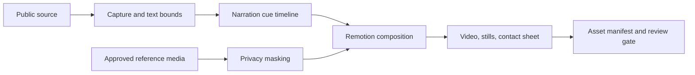

# Evidence-Driven AI Video Workflow

A reproducible workflow for narrated videos that keep claims visibly tied to their sources. It combines official web or PDF capture, line-level highlights, privacy masking, synchronized narration cues, Remotion composition, and release checks.

## Pipeline



## Repository layout

- `apps/remotion_director/` — lightweight Remotion demo and composition code.
- `scripts/source_capture/` — browser capture and DOM text-bound extraction.
- `scripts/pdf_bbox/` — PDF text-bound extraction.
- `scripts/privacy_mosaic/` — face and sensitive-region masking.
- `scripts/reference_video/` — public-page probing and local sample preparation.
- `scripts/workflow/` — orchestration and timeline generation.
- `configs/source_targets/` — source definitions.
- `examples/` — small manifests, text bounds, captures, and QA images.

## Quick start

```powershell
cd apps/remotion_director
npm install
npm run still:demo
npm run render:demo
```

Python utilities use the root requirements file:

```powershell
pip install -r requirements.txt
```

## Safety and media policy

The repository does not include credentials, cookies, login sessions, large final renders, or third-party footage without redistribution rights. Restricted avatar and voice assets must remain outside public Git history. Collection scripts do not bypass verification challenges.

Before publishing, confirm source attribution, highlight accuracy, narration timing, privacy masks, and the rights for every media asset. See [Repository Scope](docs/repository_scope.md) and [Automation Integration](docs/automation_integration.md).

## License

The project is licensed under the [Apache License 2.0](LICENSE). Third-party media and dependencies remain subject to their own licenses.
