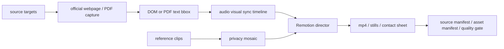

# Evidence-Driven AI Video Workflow

证据型 AI 视频生产流水线。

这个仓库整理的是一条用于高质量口播/解说视频的生产工作流：先展示官方网页、报告或 PDF 来源，再按旁白节奏动态变焦到重点句，叠加行级高亮、公开视频引用、隐私打码、字幕和质量检查结果。

它不是普通自动剪辑，也不是数学板书动画。核心目标是让视频里的信息、镜头动作和来源证据可以被复查。

## Core Idea



## Repository Layout

- `apps/remotion_director/`: Remotion 合成工程，默认提供轻量可运行 demo。
- `scripts/source_capture/`: 官方网页截图、DOM Range bbox、手动验证采集模式。
- `scripts/pdf_bbox/`: PDF 文本 bbox 提取，并生成 Remotion 可读 TypeScript 数据。
- `scripts/privacy_mosaic/`: 人脸、账号、评论、二维码等敏感信息打码。
- `scripts/reference_video/`: 公开视频页探测、来源提取和本地样本下载脚本。
- `scripts/workflow/`: 一键编排脚本和事件表生成脚本。
- `configs/source_targets/`: 来源采集目标配置。
- `examples/`: 从旧项目整理出的清单、bbox、抽帧检查图和采集结果。
- `work/`: 本地临时素材、cookie、下载视频和中间结果，默认不进 Git。
- `outputs/`: 本地渲染结果和质量检查输出，默认不进 Git。

## Install

Node / Remotion:

```powershell
cd apps/remotion_director
npm install
```

Python:

```powershell
pip install -r requirements.txt
```

如果要运行网页采集脚本，还需要 Playwright 浏览器：

```powershell
cd apps/remotion_director
npx playwright install chromium
```

## Run The Minimal Demo

默认 demo 不依赖公开视频或数字人大文件，只使用官方截图和 CNNIC bbox 数据。

```powershell
cd apps/remotion_director
npm run still:demo
npm run render:demo
```

输出在仓库根目录：

- `outputs/evidence_source_zoom_demo_frame.jpg`
- `outputs/evidence_source_zoom_demo.mp4`

## Source Capture

平台官网截图：

```powershell
node scripts/source_capture/capture_platform_pages.mjs
```

中文来源截图和 DOM bbox：

```powershell
node scripts/source_capture/capture_chinese_source_pages.mjs
```

遇到真人验证时，不自动绕过。改用可见浏览器等待人工处理：

```powershell
$env:MANUAL_CAPTURE='1'
$env:TARGET_ID='pubmed_notification'
$env:MANUAL_WAIT_MS='180000'
node scripts/source_capture/capture_v5_source_pages.mjs
```

## PDF Bbox

```powershell
python scripts/pdf_bbox/extract_cnnic_pdf_bbox.py
```

默认读取：

- `examples/source_capture/official_sources/cnnic_55_statistical_report.pdf`
- `apps/remotion_director/public/sample_assets/official_cnnic_page_40.png`

默认输出：

- `outputs/mainline_v4_sync/cnnic_pdf_bbox.json`
- `outputs/mainline_v4_sync/cnnic_pdf_bbox_debug.png`
- `apps/remotion_director/src/cnnic_pdf_bbox_v4.ts`

## Privacy Mosaic

```powershell
python scripts/privacy_mosaic/mosaic_sensitive_video.py `
  --input work/reference_video_probe/sample.mp4 `
  --output outputs/mosaic_samples/sample_face_mosaic.mp4 `
  --mode faces `
  --effect blur_mosaic `
  --mask-shape ellipse `
  --face-padding 0.20 `
  --debug-json outputs/mosaic_samples/sample_face_mosaic.json
```

默认人脸模型：

- `scripts/privacy_mosaic/models/face_detection_yunet_2023mar.onnx`

## Asset Policy

仓库主体不提交：

- `node_modules/`
- Playwright 浏览器二进制
- cookies、登录态、HAR、API key
- 大视频文件、临时下载、公开视频原片
- 版权或公开发布权限不明确的视频素材

这些内容放在：

- `work/`
- `outputs/`
- `apps/remotion_director/public/local_assets/`

数字人素材如果只允许非商用使用，可以放在 `public/local_assets/` 本地渲染，但不要默认提交到公开 GitHub 历史。需要公开复现时，优先走 Git LFS、GitHub Release 或私有存储，并写清许可。

## Review Gate

正式发布前必须检查：

- 来源 URL 和截图是否匹配。
- 旁白 cue 是否真的对应被高亮文字。
- 公开视频是否有必要引用，是否已打码。
- 人脸、账号、二维码、评论区、Logo 是否仍可识别。
- 大视频、cookie、个人信息是否被排除出 Git。

